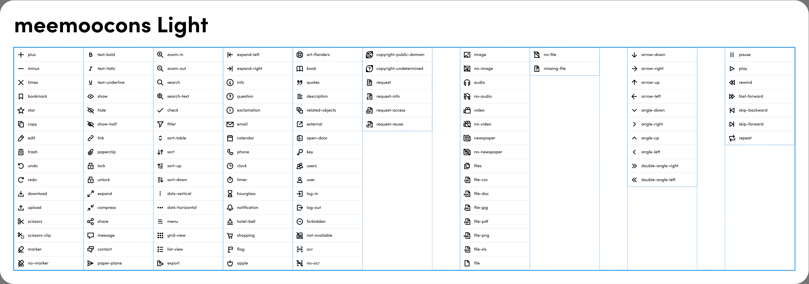
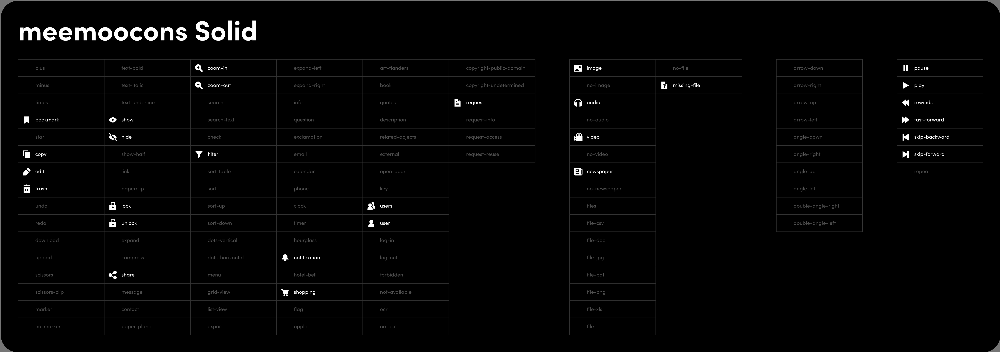

# Het Archief - icon font

## General

Het Archief contains 2 separate fonts:

- meemoocons-light
- meemoocons-solid

These fonts are managed by Jan Nikolaas. The latest versions can be found on [SHD Google drive](https://drive.google.com/drive/u/0/folders/1D-kfW7S04PuDshA9OzgUM00_NiTJ4wcz?ths=true). 
If there are icons missing please ask him for them to be added to the fonts so they can be updated here.

## Usage

Every icon available in these fonts have a corresponding key in the [Icon.enums.ts](https://github.com/viaacode/hetarchief-client/blob/master/src/modules/shared/components/Icon/Icon.enums.ts)

## Cheatsheet

A cheatsheet is provided in Figma and the most recent version can be found [here](https://www.figma.com/design/6XPR2cvjzL76lxIT3zseFv/hetarchief.be-%E2%80%94-meemoocons?node-id=1-80).

For easy development purposes we provide an image here in the repo as well:

